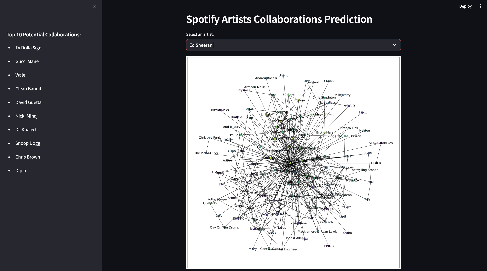
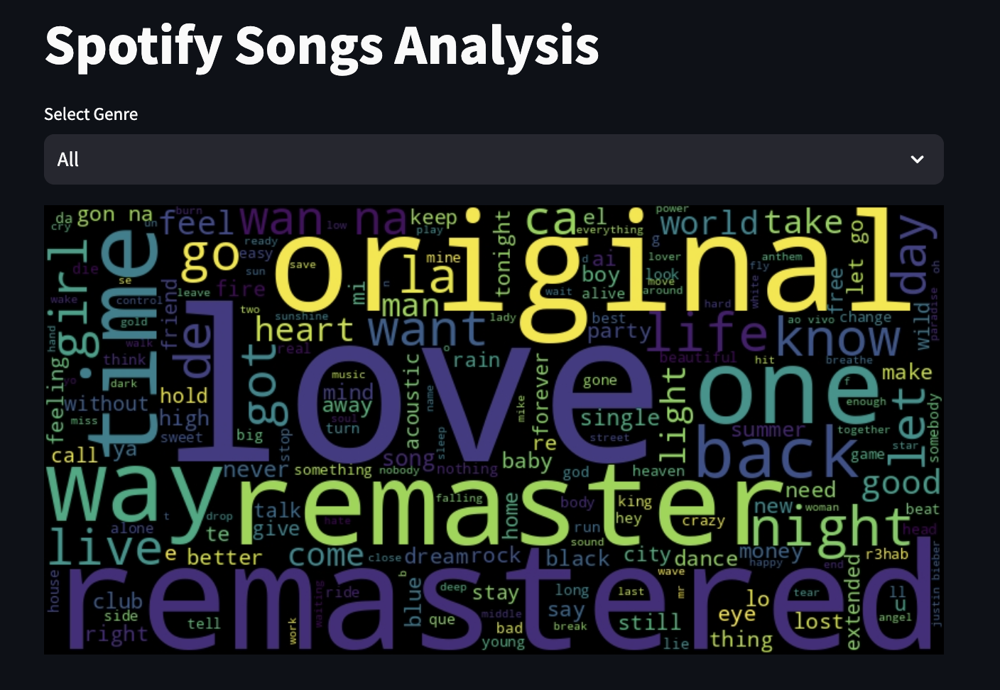

# Spotify Data Analysis and Collaboration Prediction

This project is a comprehensive analysis of Spotify songs and artists. It uses data from two different datasets: a dataset of 30,000 Spotify songs and a dataset of Spotify Artist Feature Collaboration Network. The project is divided into two main parts: Spotify Songs Analysis and Spotify Artists Collaborations Prediction.

## Spotify Songs Analysis

In this part, the project analyzes the words used in the titles of Spotify songs. It generates a word cloud to visualize the most frequently used words in song titles. The analysis can be filtered by genre, allowing you to see the most common words in song titles for a specific genre.

## Spotify Artists Collaborations Prediction

This part of the project uses a graph of artist collaborations to predict potential future collaborations. It allows you to select an artist and then displays the top 10 artists that the selected artist is most likely to collaborate with based on their past collaborations.

## Getting Started

To run this project, you need to have Python installed on your machine. You also need to install the dependencies using the following command:

```bash
pip install -r requirements.txt
```

After installing the necessary libraries, you can run the project using the following command:

```bash
streamlit run spotify_collab_script.py
```

## Project Structure

The project consists of two Python scripts:

- `spotify_collab_script.py:` This script contains functions for loading and preprocessing the data, creating the artist collaboration graph, and visualizing the graph.
- `spotify_songs.py:` This script contains the main function that loads the data, performs the song title word analysis, and displays the results in a Streamlit app.

## Screenshots

1. Spotify Artists Collaborations Prediction
   

2. Spotify Songs Analysis
   

## Contributing

Contributions are welcome! Please feel free to submit a pull request.

## License

This project is licensed under the terms of the MIT license.
